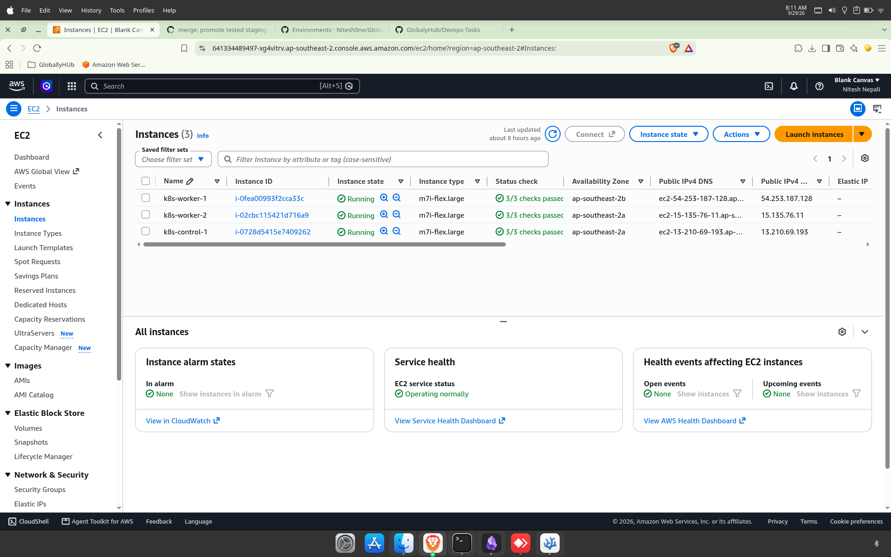
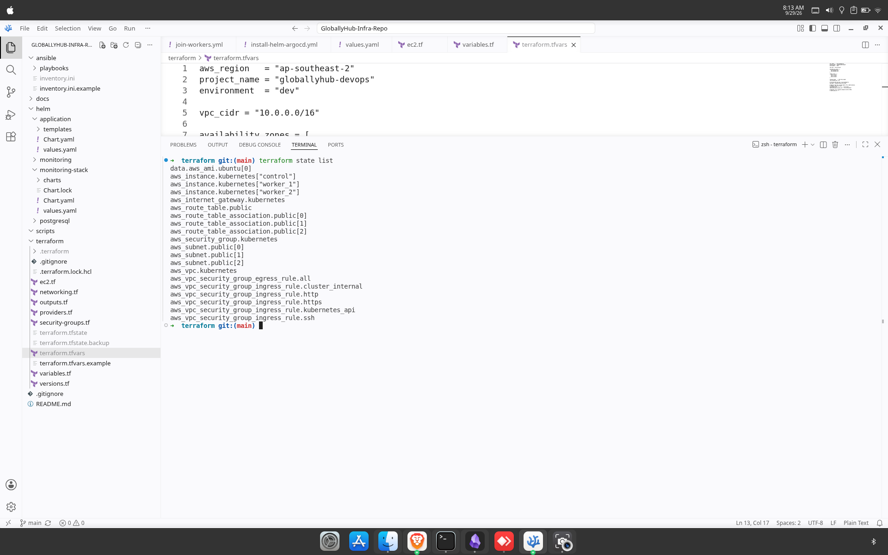
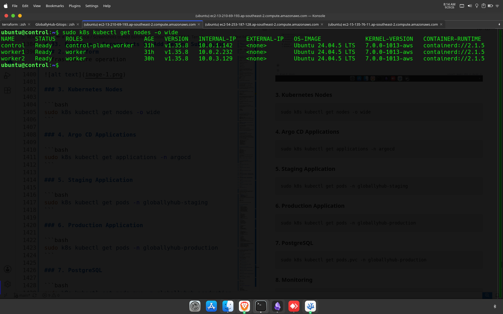
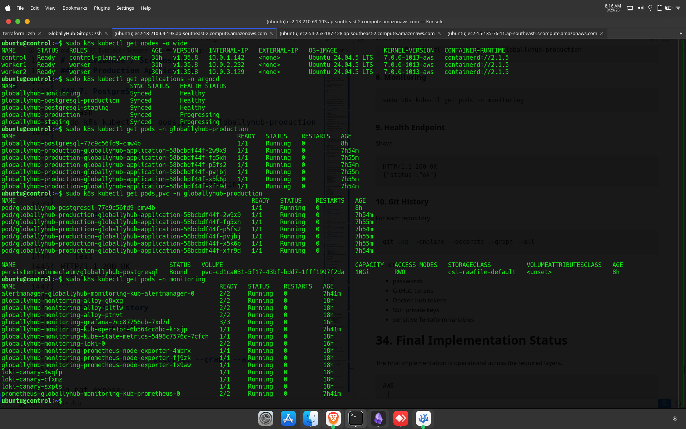
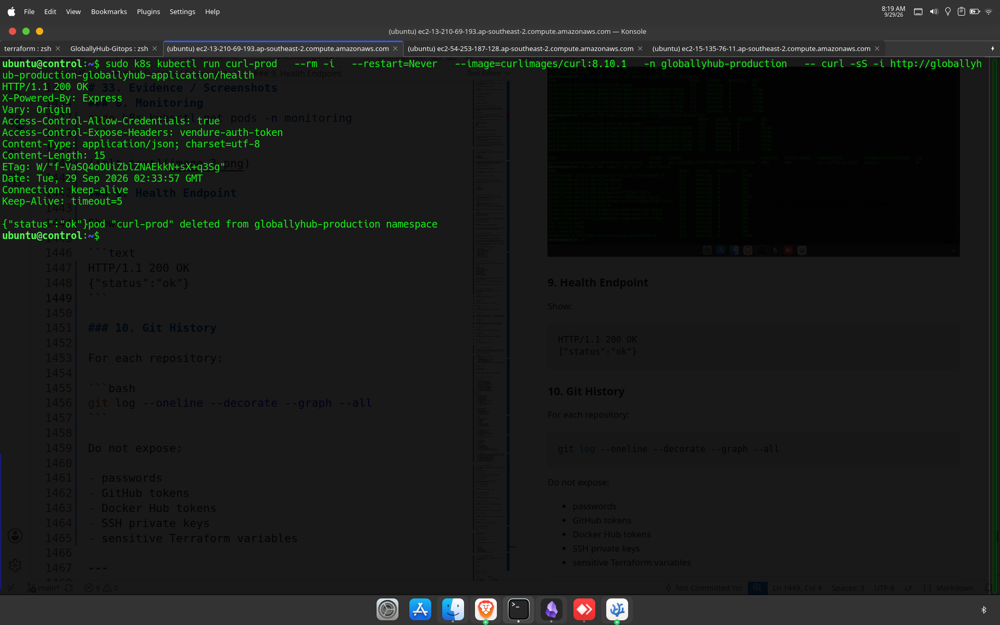

# GlobalyHub DevOps Project Assignment — 
> **Status:** Implemented and verified  
> **Purpose:** Assignment submission and repository documentation  
> **Implementation basis:** Actual commands, configuration, deployment results, and troubleshooting performed during the project

---

## 1. Project Overview

This project implements an end-to-end DevOps deployment platform for the GlobalyHub application.

The implementation is divided into three Git repositories:

| Repository | Responsibility |
|---|---|
| Application repository | Application source, Dockerfile, GitHub Actions CI/CD |
| Infrastructure repository | AWS Terraform, Ansible, Helm charts |
| GitOps repository | Argo CD Applications, environment values, monitoring configuration |

The final platform uses:

- AWS
- Terraform
- Ansible
- Canonical Kubernetes
- Helm
- Argo CD
- GitHub Actions
- Docker Hub
- PostgreSQL
- Prometheus
- Alertmanager
- Grafana
- Loki
- Grafana Alloy
- Node Exporter
- kube-state-metrics

---

# 2. Repository Layout

## 2.1 Application Repository

Repository:

`https://github.com/Nitesh0ne/GloballyHub-ApplicationRepo.git`

The application repository contains the application source, container build configuration, and CI/CD workflow.

Relevant structure:

```text
GloballyHub-App/
├── Dockerfile
├── package.json
├── package-lock.json
├── application source
└── .github/
    └── workflows/
        └── application-ci-cd.yml
```

Responsibilities:

- Application source code
- Docker image build
- CI validation
- Docker Hub publishing
- GitOps image-tag update

---

## 2.2 Infrastructure Repository

Repository:

`https://github.com/Nitesh0ne/GloballyHub-infra-repo.git`

Actual implementation structure:

```text
GloballyHub-Infra-Repo/
├── ansible/
│   ├── inventory.ini.example
│   └── playbooks/
│       ├── bootstrap-control-plane.yml
│       ├── install-helm-argocd.yml
│       ├── install-kubernetes.yml
│       ├── join-workers.yml
│       └── prepare-nodes.yml
├── helm/
│   ├── application/
│   │   ├── Chart.yaml
│   │   ├── values.yaml
│   │   └── templates/
│   │       ├── deployment.yaml
│   │       ├── service.yaml
│   │       ├── ingress.yaml
│   │       ├── hpa.yaml
│   │       ├── pdb.yaml
│   │       └── _helpers.tpl
│   └── postgresql/
│       ├── Chart.yaml
│       ├── values.yaml
│       └── templates/
│           ├── secret.yaml
│           ├── deployment.yaml
│           ├── service.yaml
│           └── pvc.yaml
├── terraform/
│   ├── ec2.tf
│   ├── networking.tf
│   ├── outputs.tf
│   ├── providers.tf
│   ├── variables.tf
│   ├── versions.tf
│   └── terraform.tfvars.example
├── docs/
├── scripts/
└── README.md
```

Responsibilities:

- AWS infrastructure
- Kubernetes node preparation
- Kubernetes installation
- Argo CD installation
- Application Helm chart
- PostgreSQL Helm chart

---

## 2.3 GitOps Repository

Repository:

`https://github.com/Nitesh0ne/GloballyHub-Gitops.git`

Actual structure:

```text
GloballyHub-Gitops/
├── argocd/
│   └── applications/
│       ├── globallyhub-production.yaml
│       ├── globallyhub-staging.yaml
│       ├── monitoring.yaml
│       ├── postgresql-production.yaml
│       └── postgresql-staging.yaml
├── environments/
│   ├── production/
│   │   └── values.yaml
│   └── staging/
│       └── values.yaml
├── monitoring/
│   └── alloy/
│       └── values.yaml
└── README.md
```

Responsibilities:

- Desired Kubernetes state
- Environment-specific application configuration
- Argo CD Applications
- Monitoring configuration
- Grafana Alloy configuration

---

# 3. AWS Infrastructure

## 3.1 AWS Region

The infrastructure was deployed to:

```text
ap-southeast-2
```

This is the AWS Sydney region.

---

## 3.2 VPC

Terraform created:

```text
VPC CIDR: 10.0.0.0/16
```

The VPC contains three public subnets:

```text
10.0.1.0/24
10.0.2.0/24
10.0.3.0/24
```

Availability zones used:

```text
ap-southeast-2a
ap-southeast-2b
```

AWS resources observed during implementation included:

```text
VPC: vpc-07dac20ede858abf5
Internet Gateway: igw-06a5f7a199edb8b3f
Route Table: rtb-06b68110860154aa3
```

Subnets observed:

```text
subnet-0a2b07c224d2532cb
subnet-00e0fe26143861c50
subnet-0287c33846eb9ec06
```

There is no NAT Gateway. Public subnets and public IPs were used to keep the implementation simpler and avoid NAT Gateway recurring cost.

---

## 3.3 EC2 Kubernetes Nodes

The cluster contains three Ubuntu 24.04 LTS EC2 nodes:

| Node | Kubernetes role | Private IP |
|---|---|---|
| `k8s-control-1` | Control plane + worker | `10.0.1.142` |
| `k8s-worker-1` | Worker | `10.0.2.232` |
| `k8s-worker-2` | Worker | `10.0.3.129` |

Kubernetes version observed:

```text
v1.35.8
```

The EC2 root disks use encrypted gp3 volumes.

The initial root volume size was 30 GB. During PostgreSQL/OpenEBS provisioning, the CSI provisioner reported insufficient disk space. The disks were increased to 50 GB and Terraform was updated to match the final configuration.

---

# 4. AWS Security Group

The Kubernetes security group contains these functional rules:

| Port | Purpose | Source |
|---|---|---|
| 22/TCP | SSH / Ansible | Administrator `/32` |
| 6443/TCP | Kubernetes API | Administrator `/32` |
| 80/TCP | HTTP | Public |
| 443/TCP | HTTPS | Public |
| All | Node-to-node Kubernetes traffic | Same security group |
| All | Outbound | All |

The Kubernetes API and SSH access were intentionally restricted rather than opened to the whole Internet.

EC2 Instance Metadata Service was configured to require IMDSv2.

---

# 5. Terraform Implementation

Terraform is used to provision the AWS infrastructure.

## 5.1 Terraform Provider

The AWS provider uses the project region variable and applies default tags:

```hcl
provider "aws" {
  region = var.aws_region

  default_tags {
    tags = {
      Project     = var.project_name
      ManagedBy   = "Terraform"
      Environment = var.environment
    }
  }
}
```

Terraform requires version:

```text
>= 1.6.0
```

AWS provider:

```text
~> 6.0
```

## 5.2 Terraform Resources

Terraform manages:

- VPC
- Subnets
- Internet Gateway
- Route table
- Security group
- EC2 instances
- EC2 storage
- Instance metadata configuration
- Outputs for node information

## 5.3 Sensitive/Local Files

The following are excluded from Git:

```text
terraform.tfstate
terraform.tfstate.backup
terraform.tfvars
```

The actual `terraform.tfvars` was used locally and was not committed.

---

# 6. Ansible Implementation

Ansible was used to configure the EC2 instances after Terraform provisioning.

## 6.1 Playbooks

```text
prepare-nodes.yml
install-kubernetes.yml
bootstrap-control-plane.yml
join-workers.yml
install-helm-argocd.yml
```

## 6.2 Node Preparation

The preparation playbook configured:

- Required packages
- Hostnames
- Kernel modules
- Kubernetes sysctl settings
- Swap configuration
- Kubernetes prerequisites

The playbook was tested twice.

The second run was idempotent:

```text
control : ok=8 changed=0 unreachable=0 failed=0 skipped=1 rescued=0 ignored=0
worker1 : ok=8 changed=0 unreachable=0 failed=0 skipped=1 rescued=0 ignored=0
worker2 : ok=8 changed=0 unreachable=0 failed=0 skipped=1 rescued=0 ignored=0
```

This confirmed that already-correct configuration was not unnecessarily changed.

---

# 7. Kubernetes Cluster

Canonical Kubernetes was installed using Ansible.

Final observed node state:

```text
control   Ready   control-plane,worker   v1.35.8   10.0.1.142
worker1   Ready   worker                  v1.35.8   10.0.2.232
worker2   Ready   worker                  v1.35.8   10.0.3.129
```

All three nodes were successfully joined to the cluster.

Observed resource usage after the EC2 capacity increase was approximately:

```text
control   CPU 109m (5%)   Memory 2568Mi (33%)
worker1   CPU 35m  (1%)   Memory 1645Mi (21%)
worker2   CPU 40m  (2%)   Memory 1453Mi (18%)
```

---

# 8. Argo CD

Argo CD was installed using Helm.

Observed versions:

```text
Helm chart: 10.9.2
Argo CD application version: 3.5.3
```

Argo CD manages the Kubernetes deployments from Git.

Repository authentication was configured using read-only SSH deploy keys.

The GitOps repository was registered with Argo CD as:

```text
argocd-gitops-repository
```

---

# 9. Application Helm Chart

The application Helm chart is located in:

```text
helm/application/
```

The chart contains the required Kubernetes resources:

```text
Deployment
Service
Ingress
HPA
PodDisruptionBudget
```

The application service uses:

```text
Service port: 80
Container target port: 3000
```

The application deployment reads database and application configuration from Kubernetes Secrets.

---

# 10. PostgreSQL Helm Chart

PostgreSQL is packaged as:

```text
helm/postgresql/
```

It contains:

- Deployment
- Service
- PVC
- Optional Secret template

The production and staging PostgreSQL workloads are managed independently by Argo CD.

Both final PostgreSQL Argo CD Applications were observed as:

```text
Synced / Healthy
```

---

# 11. Application Container

The application uses a multi-stage Node.js Docker build.

Builder:

```dockerfile
FROM node:24-bookworm-slim AS builder
WORKDIR /usr/src/app

COPY package.json package-lock.json ./
RUN npm ci

COPY . .
RUN npm run build
```

Runtime:

```dockerfile
FROM node:24-bookworm-slim AS runtime
WORKDIR /usr/src/app

ENV NODE_ENV=production

COPY package.json package-lock.json ./
RUN npm ci --omit=dev && npm cache clean --force

COPY --from=builder /usr/src/app/dist ./dist
COPY --from=builder /usr/src/app/static ./static

RUN chown -R node:node /usr/src/app
USER node

CMD ["node", "./dist/index.js"]
```

The final runtime container runs as the non-root `node` user.

---

# 12. GitHub Actions CI/CD

The application repository contains the GitHub Actions CI/CD workflow.

The workflow runs for:

```text
main
production
prod
staging
develop
```

Pull requests to these branches are also validated.

## 12.1 Environment Mapping

```text
main       -> production
production -> production
prod       -> production

staging    -> staging
develop    -> staging
```

## 12.2 CI/CD Flow

```text
Git push
   |
   v
GitHub Actions
   |
   +--> Validate
   |
   +--> Build application
   |
   +--> Build Docker image
   |
   +--> Push image to Docker Hub
   |
   +--> Update GitOps repository
   |
   v
Argo CD
   |
   v
Kubernetes
```

## 12.3 Docker Image

Docker Hub image:

```text
docker.io/nitace/globallyhub-app
```

The image tag is the Git commit SHA.

One observed production image tag was:

```text
922e0d675c65761cbae7c12cf820d8656d885f64
```

This provides traceability between source code and deployed container.

## 12.4 GitHub Environment Secrets

The same logical secret names are used for the environments, with values separated through GitHub Environments:

```text
DOCKERHUB_USERNAME
DOCKERHUB_TOKEN
GITOPS_REPO_TOKEN
```

The secret values are not stored in the repository.

---

# 13. GitOps Deployment

Argo CD Applications use the Infrastructure repository for the Helm chart and the GitOps repository for environment-specific values.

For example, staging uses:

```text
Infra repository
    |
    +--> helm/application
             |
             +--> GitOps staging values
```

Production uses the corresponding production values.

Argo CD has automated synchronization enabled:

```yaml
automated:
  prune: true
  selfHeal: true
```

Namespaces are created automatically where required.

---

# 14. Staging Configuration

Observed staging values include:

```yaml
replicaCount: 2

image:
  repository: docker.io/nitace/globallyhub-app
  tag: "357299f6fd4263281d61572fb2ca1b5d4c96963d"
  pullPolicy: IfNotPresent

service:
  type: ClusterIP
  port: 80
  targetPort: 3000

ingress:
  enabled: true

autoscaling:
  enabled: true
  minReplicas: 2
  maxReplicas: 5
  targetCPUUtilizationPercentage: 70
  targetMemoryUtilizationPercentage: 80

podDisruptionBudget:
  enabled: true
  minAvailable: 1
```

Staging host configured in the values file:

```text
globallyhub-staging.example.com
```

---

# 15. Production Configuration

Observed production values include:

```yaml
replicaCount: 3

image:
  repository: docker.io/nitace/globallyhub-app
  tag: "922e0d675c65761cbae7c12cf820d8656d885f64"
  pullPolicy: IfNotPresent

service:
  type: ClusterIP
  port: 80
  targetPort: 3000

autoscaling:
  enabled: true
  minReplicas: 3
  maxReplicas: 6
  targetCPUUtilizationPercentage: 70
  targetMemoryUtilizationPercentage: 80

podDisruptionBudget:
  enabled: true
  minAvailable: 2

application:
  env: production
```

Production host configured in the values file:

```text
globallyhub.example.com
```

The production deployment was verified directly:

```text
APP_ENV=production
```

---

# 16. Kubernetes Secrets

Secrets were intentionally kept outside Git.

## Database Secret

The application consumes:

```text
globallyhub-db
```

with keys:

```text
DB_NAME
DB_USERNAME
DB_PASSWORD
DB_SCHEMA
```

## Application Secret

The application consumes:

```text
globallyhub-app
```

with keys:

```text
COOKIE_SECRET
SUPERADMIN_USERNAME
SUPERADMIN_PASSWORD
```

The real values are intentionally not included in this document.

---

# 17. Staging Verification

The staging deployment was successfully rolled out.

Observed staging state included:

- PostgreSQL pod running
- Application pods running
- HPA active
- Service available
- PDB configured
- Ingress configured

The application health endpoint was tested from inside the cluster.

Observed response:

```text
HTTP/1.1 200 OK

{"status":"ok"}
```

The staging Argo CD Application was synchronized.

---

# 18. Production Verification

Production was successfully rolled out after resolving the missing Secret issue.

Observed application pods:

```text
globallyhub-production-globallyhub-application-58bcbdf44f-2w9x9   1/1 Running
globallyhub-production-globallyhub-application-58bcbdf44f-fg5xh   1/1 Running
globallyhub-production-globallyhub-application-58bcbdf44f-p5fs2   1/1 Running
globallyhub-production-globallyhub-application-58bcbdf44f-pvjbj   1/1 Running
globallyhub-production-globallyhub-application-58bcbdf44f-x5k6p   1/1 Running
globallyhub-production-globallyhub-application-58bcbdf44f-xfr9d   1/1 Running
```

Deployment status:

```text
6/6 READY
6/6 UP-TO-DATE
6/6 AVAILABLE
```

Environment verification:

```text
APP_ENV=production
```

Health endpoint:

```text
HTTP/1.1 200 OK

{"status":"ok"}
```

---

# 19. PostgreSQL Verification

## Staging

Observed:

```text
globallyhub-postgresql
1/1 Running
```

PVC:

```text
Bound
10Gi
RWO
csi-rawfile-default
```

## Production

Observed:

```text
globallyhub-postgresql-77c9c56fd9-cmw4b
1/1 Running
```

PVC:

```text
globallyhub-postgresql
Bound
10Gi
RWO
csi-rawfile-default
```

The final PostgreSQL Argo CD Applications were:

```text
globallyhub-postgresql-production   Synced   Healthy
globallyhub-postgresql-staging      Synced   Healthy
```

---

# 20. Monitoring Implementation

The monitoring stack is managed by the Argo CD Application:

```text
globallyhub-monitoring
```

The monitoring stack contains:

- Prometheus
- Alertmanager
- Grafana
- Loki
- Grafana Alloy
- Prometheus Node Exporter
- kube-state-metrics
- Prometheus Operator
- Loki canary

The monitoring Helm configuration uses:

```text
kube-prometheus-stack
Loki
Grafana Alloy
```

The versions observed during implementation included:

```text
kube-prometheus-stack: 91.8.1
Loki: 7.3.0
Alloy: 1.13.0
```

---

# 21. Final Monitoring Pod State

The final command:

```bash
sudo k8s kubectl get pods -n monitoring
```

returned all monitoring workloads in `Running` state.

Observed resources included:

```text
alertmanager-globallyhub-monitoring-kub-alertmanager-0
    2/2 Running

globallyhub-monitoring-alloy-g8xxg
    2/2 Running

globallyhub-monitoring-alloy-pltlw
    2/2 Running

globallyhub-monitoring-alloy-ptnvt
    2/2 Running

globallyhub-monitoring-grafana-7cc87756cb-7xd7d
    3/3 Running

globallyhub-monitoring-kub-operator-6b564cc8bc-krxjp
    1/1 Running

globallyhub-monitoring-kube-state-metrics-5498c7576c-7cfch
    1/1 Running

globallyhub-monitoring-loki-0
    2/2 Running

globallyhub-monitoring-prometheus-node-exporter-4mbrx
    1/1 Running

globallyhub-monitoring-prometheus-node-exporter-fj9zk
    1/1 Running

globallyhub-monitoring-prometheus-node-exporter-tx9ww
    1/1 Running

loki-canary-4wqfp
    1/1 Running

loki-canary-cfxmz
    1/1 Running

loki-canary-sxpts
    1/1 Running

prometheus-globallyhub-monitoring-kub-prometheus-0
    2/2 Running
```

No restarts were observed in this final output.

---

# 22. Final Argo CD State

The final command:

```bash
sudo k8s kubectl get applications -n argocd
```

returned:

```text
NAME                              SYNC STATUS   HEALTH STATUS

globallyhub-monitoring            Synced        Healthy
globallyhub-postgresql-production Synced        Healthy
globallyhub-postgresql-staging    Synced        Healthy
globallyhub-production            Synced        Progressing
globallyhub-staging               Synced        Progressing
```

### Interpretation

The monitoring and PostgreSQL Applications were fully healthy.

The application Applications were synchronized with Git and were still shown by Argo CD as `Progressing`. This was not treated as evidence of application failure because the actual application deployments and `/health` endpoints were independently verified successfully.

No further destructive changes were made solely to change the Argo health label.

---

# 23. Monitoring Problem: Initial Missing Prometheus/Alertmanager Pods

One of the monitoring issues encountered during implementation was that Prometheus and Alertmanager Custom Resources existed but their server pods were initially absent.

Initial investigation included:

```bash
kubectl get prometheus -n monitoring
kubectl get alertmanager -n monitoring
kubectl get pods -n monitoring
kubectl get statefulset -n monitoring
kubectl get events -n monitoring
```

The CRs existed, but the expected server workloads were initially missing.

The monitoring Argo CD Application had also encountered CRD synchronization problems because some CRDs had annotations too large for normal client-side apply.

The monitoring Application was changed to use:

```yaml
syncOptions:
  - CreateNamespace=true
  - ServerSideApply=true
```

After reconciliation, the operator successfully created the Prometheus and Alertmanager workloads.

Final result:

```text
Prometheus       2/2 Running
Alertmanager     2/2 Running
Operator         1/1 Running
```

Final Argo CD monitoring state:

```text
Synced / Healthy
```

---

# 24. PostgreSQL Storage Problem

During the initial PostgreSQL deployment, the PVC remained Pending.

The storage provisioner reported:

```text
rpc error: code = ResourceExhausted desc = Not enough disk space
```

The StorageClass involved was:

```text
csi-rawfile-default
```

with provisioner:

```text
rawfile.csi.openebs.io
```

The initial EC2 root disk size was 30 GB.

The node still showed available space, but the CSI provisioner was unable to provision the required storage.

### Resolution

The EC2 root disk size was increased to 50 GB.

Terraform was also updated to reflect the final 50 GB configuration.

After the change, the production PVC became:

```text
globallyhub-postgresql
Bound
10Gi
RWO
csi-rawfile-default
```

PostgreSQL subsequently became healthy.

---

# 25. Argo CD Redis Installation Problem

The first Argo CD installation encountered a Redis initialization problem.

The cluster node capacity was increased before reinstalling Argo CD.

The subsequent installation completed successfully.

The final Argo CD installation was operational and able to manage the GitOps Applications.

---

# 26. Production Secret Problem

During the production application rollout, some pods initially reported:

```text
ImagePullBackOff
ErrImagePull
CreateContainerConfigError
```

Further investigation showed that the application image was being pulled successfully for the newer rollout, but required Kubernetes Secrets were missing.

The application reported:

```text
secret "globallyhub-db" not found
```

After creating the database Secret, the application then reported:

```text
secret "globallyhub-app" not found
```

The required application Secret was created.

After both Secrets existed, the production deployment completed successfully.

Final result:

```text
6/6 READY
6/6 UP-TO-DATE
6/6 AVAILABLE
```

---

# 27. Docker Image / GitOps Promotion

The application repository was developed through staging and then promoted to `main`.

The application history included:

```text
aabac88 Initial commit
436c5d5 feat: add application and container configuration
f768d13 ci: implement Docker Hub and GitOps deployment
```

Staging changes were promoted with a non-fast-forward merge:

```bash
git merge --no-ff staging -m "merge: promote tested staging changes to main"
git push origin main
```

The production image tag was then updated automatically in the GitOps repository.

Observed production tag:

```text
922e0d675c65761cbae7c12cf820d8656d885f64
```

This preserved Git history and connected the production deployment to a specific application commit.

---

# 28. Git History Requirement

The assignment requires that Git history not be squashed or rewritten.

The implementation followed that requirement.

The project contains multiple meaningful commits instead of replacing the history with one final commit.

The promotion from staging to production was performed with a normal merge commit.

This allows the reviewer to inspect:

- Initial setup
- Application implementation
- Docker configuration
- CI/CD implementation
- Staging work
- Production promotion
- GitOps changes
- Infrastructure changes
- Monitoring changes

---

# 29. Security and Secret Handling

The following sensitive data was intentionally kept out of Git:

```text
Terraform state
terraform.tfvars
Ansible private inventory
SSH private keys
Docker Hub tokens
GitHub tokens
Database passwords
Application secrets
```

The Kubernetes Secrets were created directly in the target namespaces.

The real values are intentionally omitted from this report.

The Docker runtime also runs as a non-root user.

---

# 30. Actual Verification Commands

These are the main commands used to verify the implementation.

## Nodes

```bash
sudo k8s kubectl get nodes -o wide
```

## Monitoring

```bash
sudo k8s kubectl get pods -n monitoring
```

## Argo CD

```bash
sudo k8s kubectl get applications -n argocd
```

## PostgreSQL

```bash
sudo k8s kubectl get pods,pvc -n globallyhub-staging
sudo k8s kubectl get pods,pvc -n globallyhub-production
```

## Application

```bash
sudo k8s kubectl get pods -n globallyhub-staging
sudo k8s kubectl get pods -n globallyhub-production
```

## Prometheus

```bash
sudo k8s kubectl get prometheus -n monitoring
```

## Alertmanager

```bash
sudo k8s kubectl get alertmanager -n monitoring
```

## Services

```bash
sudo k8s kubectl get svc -A
```

---

# 31. Application Health Test

The application health endpoint was tested from inside the Kubernetes cluster using a temporary curl pod.

Example production command:

```bash
sudo k8s kubectl run curl-prod \
  --rm -i \
  --restart=Never \
  --image=curlimages/curl:8.10.1 \
  -n globallyhub-production \
  -- curl -sS -i http://globallyhub-production-globallyhub-application/health
```

Observed response:

```text
HTTP/1.1 200 OK
{"status":"ok"}
```

The same approach was used to verify staging.

---

# 32. Final Acceptance Checklist

## Application

- [x] Application deployed
- [x] Dockerfile implemented
- [x] Multi-stage image build
- [x] Non-root container runtime
- [x] GitHub Actions CI/CD
- [x] Staging branch mapping
- [x] Production branch mapping
- [x] Docker Hub publishing
- [x] GitOps image-tag update
- [x] GitHub Environment secrets

## AWS

- [x] VPC
- [x] Three subnets
- [x] Internet Gateway
- [x] Route table
- [x] Security group
- [x] Three EC2 nodes
- [x] Encrypted gp3 storage
- [x] IMDSv2
- [x] Restricted SSH
- [x] Restricted Kubernetes API

## Kubernetes

- [x] Control plane
- [x] Two workers
- [x] All nodes Ready
- [x] Kubernetes v1.35.8
- [x] Ansible provisioning
- [x] Helm installed
- [x] Argo CD installed

## Helm

- [x] Application chart
- [x] Deployment
- [x] Service
- [x] Ingress
- [x] HPA
- [x] PodDisruptionBudget
- [x] PostgreSQL chart
- [x] PersistentVolumeClaim

## GitOps

- [x] Argo CD Applications
- [x] Staging values
- [x] Production values
- [x] Automated synchronization
- [x] Self-healing
- [x] Pruning
- [x] Git-managed desired state

## Monitoring

- [x] Prometheus
- [x] Alertmanager
- [x] Grafana
- [x] Loki
- [x] Grafana Alloy
- [x] Node Exporter
- [x] kube-state-metrics
- [x] Prometheus Operator
- [x] Monitoring managed by Argo CD
- [x] Monitoring Application Synced/Healthy

## Verification

- [x] Staging application health endpoint: HTTP 200
- [x] Production application health endpoint: HTTP 200
- [x] Production `APP_ENV=production`
- [x] Staging PostgreSQL healthy
- [x] Production PostgreSQL healthy
- [x] Final monitoring pods Running
- [x] Git history preserved
- [x] Sensitive files excluded from Git

---

# 33. Evidence / Screenshots 

The screenshots of important steps with the system date/time visible.

Recommended evidence:

### 1. AWS / EC2

The three EC2 nodes and their running state.



### 2. Terraform

Final Terraform outputs or the successful infrastructure operation 



### 3. Kubernetes Nodes

```bash
sudo k8s kubectl get nodes -o wide
```



### 4. Argo CD Applications

```bash
sudo k8s kubectl get applications -n argocd
```

### 5. Staging Application

```bash
sudo k8s kubectl get pods -n globallyhub-staging
```

### 6. Production Application

```bash
sudo k8s kubectl get pods -n globallyhub-production
```

### 7. PostgreSQL

```bash
sudo k8s kubectl get pods,pvc -n globallyhub-production
```

### 8. Monitoring

```bash
sudo k8s kubectl get pods -n monitoring
```



### 9. Health Endpoint

Show:

```text
HTTP/1.1 200 OK
{"status":"ok"}
```




---

# 34. Final Implementation Status

The final implementation is operational across the required layers.

```text
AWS
 |
 v
Terraform
 |
 v
EC2
 |
 v
Canonical Kubernetes
 |
 +-------------------------+
 |                         |
 v                         v
Argo CD                Monitoring
 |                         |
 +--> Staging              +--> Prometheus
 +--> Production           +--> Alertmanager
 +--> PostgreSQL           +--> Grafana
                           +--> Loki
                           +--> Alloy
                           +--> Exporters
```

The final observed state was:

```text
Kubernetes:
  3/3 nodes Ready

Monitoring:
  Synced / Healthy

PostgreSQL:
  Staging   Synced / Healthy
  Production Synced / Healthy

Application:
  Staging    Synced / Progressing
  Production Synced / Progressing

Application health:
  Staging    HTTP 200
  Production HTTP 200

Production environment:
  APP_ENV=production
```

The application workloads were running successfully when final verification was performed.

---


